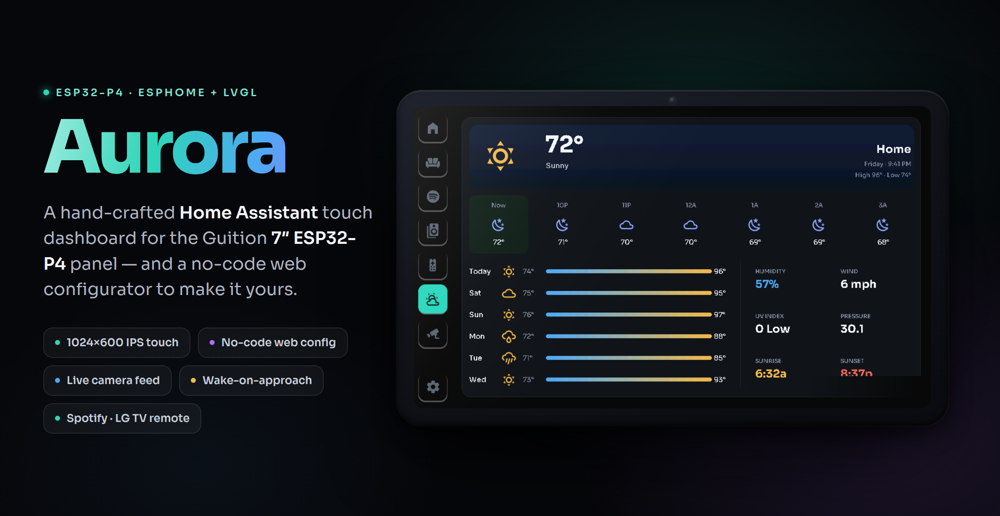
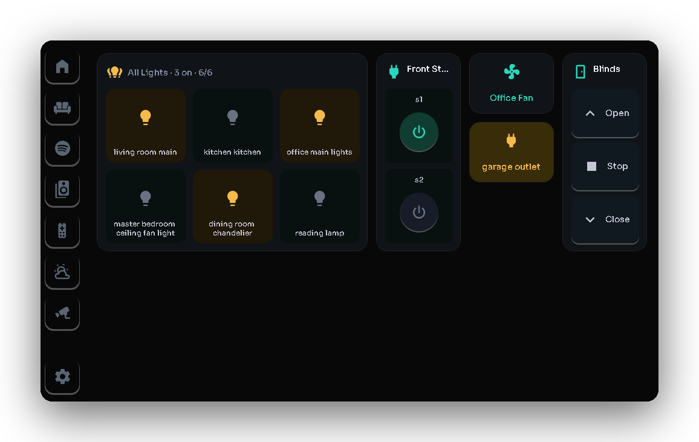
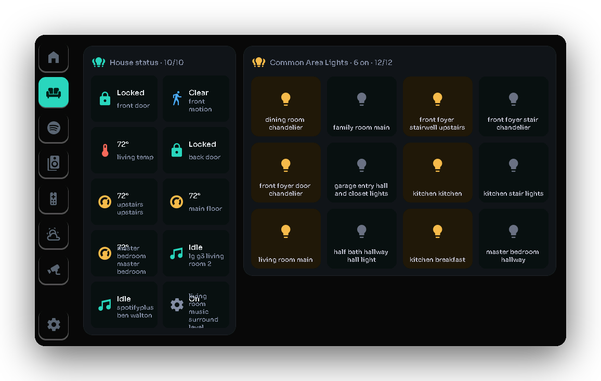
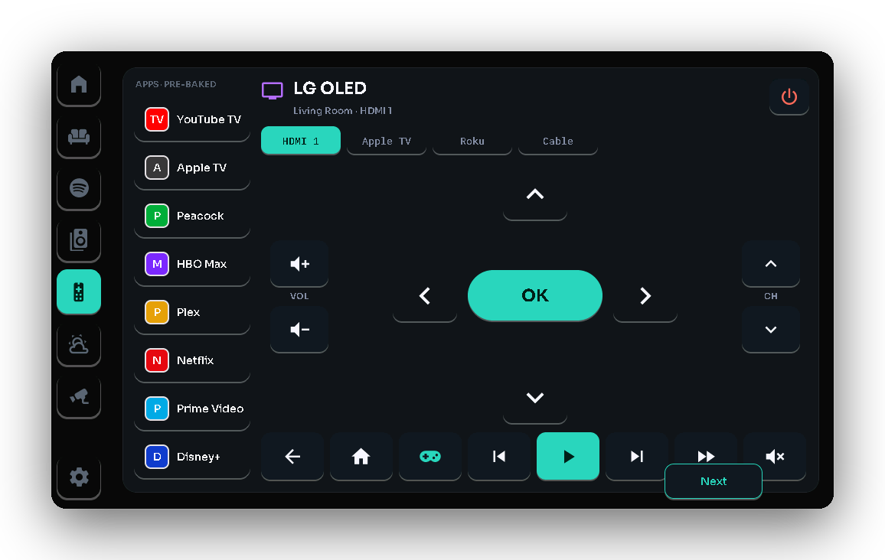
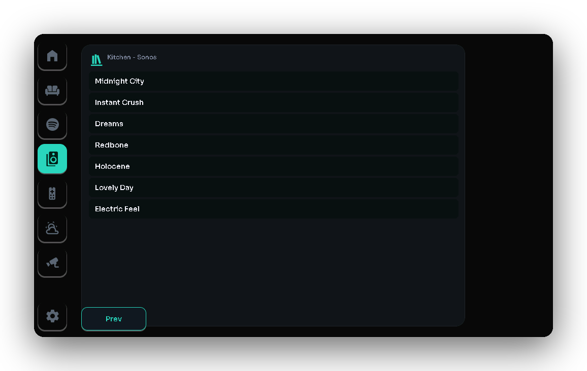
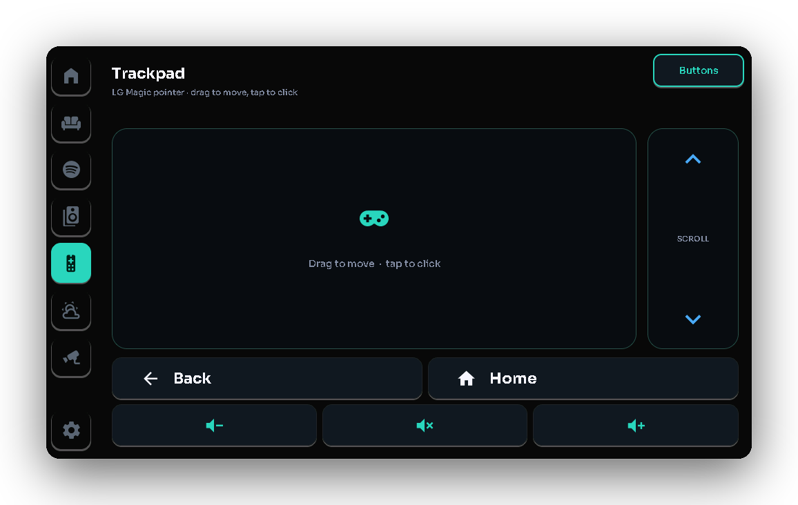
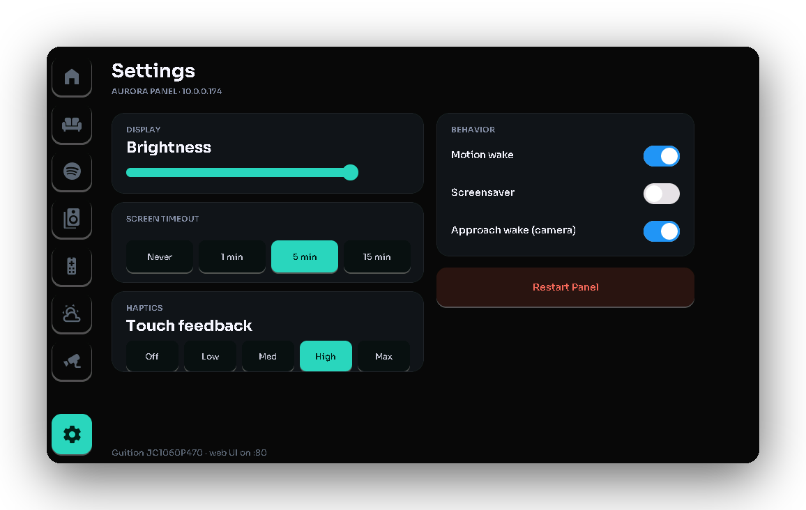
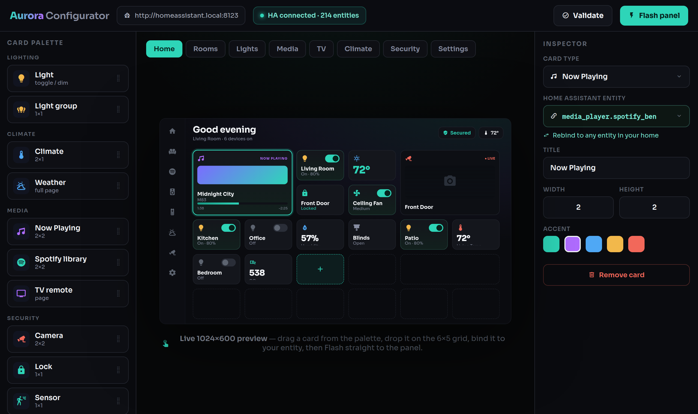

<div align="center">



### A hand-crafted **Home Assistant** touch dashboard for the Guition **7″ ESP32-P4** panel — with a **no-code web configurator** to make it yours.

[](https://www.espressif.com/en/products/socs/esp32-p4)
[](https://esphome.io)
[](#hardware)
[](#-design-it-your-way--no-yaml-required)
[](LICENSE)

**[Quick start](#quick-start)** · **[Configurator](#-design-it-your-way--no-yaml-required)** · **[Features](#whats-inside)** · **[Hardware](#hardware)** · **[Roadmap](#status--roadmap)**

</div>

---

Aurora is a standalone [ESPHome](https://esphome.io) + LVGL firmware with a hand-designed dark/glass UI — a clock + greeting home screen, configurable per-room controls, a full Spotify experience (now-playing with album art, room/zone selection, a browsable library), climate, security **with a live camera feed**, network status, an LG webOS TV remote, a photo screensaver, and device settings. The panel's onboard camera also drives **night-time wake-on-approach** — it lights up when you walk toward it.

> **Heritage / credit:** Aurora began as a fork of [jtenniswood/espcontrol](https://github.com/jtenniswood/espcontrol) and reuses its proven hardware bring-up (display, touch, WiFi). The dashboard UI here (`devices/guition-esp32-p4-jc1060p470/aurora.yaml`) is a complete, independent rewrite and no longer uses the espcontrol button-grid engine. See `LICENSE`/`NOTICE` for upstream attribution.

> **The screenshots below are real firmware** — rendered straight from the LVGL UI on ESPHome's host platform, the same layout, fonts and colors drawn on the panel.

---

## A tour of the panel

<div align="center">
<table>
<tr>
<td width="33%" valign="top"><br><sub><b>Room controls</b> — lights, fans, switches &amp; blinds, one tap away</sub></td>
<td width="33%" valign="top"><br><sub><b>Home at a glance</b> — locks, sensors &amp; every light in one board</sub></td>
<td width="33%" valign="top"><br><sub><b>LG webOS remote</b> — D-pad, transport &amp; app shortcuts</sub></td>
</tr>
<tr>
<td width="33%" valign="top"><br><sub><b>Spotify library</b> — browse playlists → tap to play in any room</sub></td>
<td width="33%" valign="top"><br><sub><b>Magic-Remote trackpad</b> — a real cursor, scroll &amp; volume</sub></td>
<td width="33%" valign="top"><br><sub><b>On-device settings</b> — brightness, timeout &amp; wake-on-approach</sub></td>
</tr>
</table>
</div>

---

## 🎨 Design it your way — no YAML required

Aurora ships a **no-code web configurator** that runs locally on your build machine. Point it at your Home Assistant, lay out screens by drag-and-drop, and flash the panel — never touch a line of YAML.

<div align="center">

</div>

<table>
<tr>
<td width="50%" valign="top">

**🧩 Drag-and-drop page builder**<br>
Arrange cards on a 6×5 grid per page with a **live preview** that matches the panel pixel-for-pixel. Lights, climate, sensors, locks, covers, fans, media / now-playing, the Spotify playlist / track-list / **speaker-picker** cards, Sonos grouping, the TV remote (with trackpad), cameras, weather and more.

**🔗 Entity-rebind wizard**<br>
Reads the panel's entity slots, lists **your** Home Assistant entities (you supply your HA URL + a token), and lets you map each card to one of yours.

</td>
<td width="50%" valign="top">

**🛋️ Rooms wizard**<br>
Add, rename and reassign rooms and their entities — room pages, the picker and state sensors are generated for you.

**⚡ One-click flash**<br>
The **Flash** button runs the whole `layout.json → aurora-gen.yaml → build → OTA` pipeline. Your layout is saved to `layout.json`; nothing is hand-edited.

</td>
</tr>
</table>

```bash
source ~/aurora-venv/bin/activate        # the venv with esphome installed
python3 aurora-build/configurator/serve.py
# then open http://localhost:8765
```

<sub>See the full walkthrough in **[Web configurator](#web-configurator)** below.</sub>

---

## What's inside

<table>
<tr>
<td width="33%" valign="top"><h4>📷 Live camera + wake-on-approach</h4>The onboard OV02C10 hardware-encodes H.264 and serves RTSP to Home Assistant. The same frames feed an on-device motion detector that <b>wakes the panel when you walk up at night</b>.</td>
<td width="33%" valign="top"><h4>🎵 Spotify, done right</h4>Now-playing with album art &amp; progress, play / pause / skip / volume, a <b>speaker picker</b> for any Spotify Connect device, and a browsable playlist → track library.</td>
<td width="33%" valign="top"><h4>📺 LG TV remote + trackpad</h4>A full webOS remote — D-pad, power, volume, channel, media transport and app shortcuts — plus a real <b>Magic-Remote trackpad</b> with cursor, scroll and volume.</td>
</tr>
<tr>
<td width="33%" valign="top"><h4>🛋️ Dynamic rooms</h4>Rooms are <b>data-driven</b> from <code>rooms.json</code> — add, rename and reassign rooms and their lights, fans and switches without editing YAML.</td>
<td width="33%" valign="top"><h4>🖼️ Photo screensaver</h4>A photo slideshow served from Home Assistant, with a clock and outdoor-temperature overlay, gated to an evening window.</td>
<td width="33%" valign="top"><h4>🔄 Wireless OTA</h4>One USB flash to get started; every update after that is over-the-air. WiFi is tuned (<code>fast_connect</code>, no power-save) for a responsive panel.</td>
</tr>
</table>

---

## Screens

| Screen | What it does |
|---|---|
| **Home** | Live clock + greeting, weather/presence/secured chips, a large Now-Playing card (album art + transport), and a 2×2 grid (Climate, Lights, Doors & Sensors, Quick nav). |
| **Rooms** | Pick a room → control that room's lights (tap to toggle, slider to dim), fans (with spin animation), and switches. Rooms are **data-driven** — generated from `rooms.json` by the configurator, so you can add/rename/reassign rooms and entities without editing YAML. |
| **Lights** | Selectable light list with a brightness arc + on/off. |
| **Media** | Spotify (SpotifyPlus): now-playing (album art + progress bar + elapsed/remaining, honest "Nothing playing" when idle), play/pause/skip/volume, a **speaker picker** that loads every available Spotify Connect speaker so you can choose which room to play in, and a Library (playlist → scrollable track list → tap to play on the chosen speaker). |
| **Climate** | Outdoor temperature, condition, humidity, wind (from `weather.forecast_home`). |
| **Security** | Front/back door lock state + control, presence, and a **live camera feed** from the panel's onboard camera (streamed to HA over RTSP/H.264). |
| **Network** | Panel WiFi signal, Synology status. |
| **Settings** | Display brightness, screen timeout, wake-on-presence, screen saver, and **Approach wake** (night-time camera wake-on-approach). |
| **Screensaver** | Photo slideshow (images served from HA) with a clock + outdoor temperature overlay. |
| **TV Remote** | Full LG webOS remote (D-pad, Power/Home/Back/Exit/Menu/Info, volume/mute, channel, media transport, and app shortcuts that highlight the app currently on screen), plus a **Magic-Remote trackpad page** — a real drag-to-move cursor + scroll wheel with Back / Home / Volume buttons, driven by the LG pointer bridge. |

---

## Hardware

- **Panel:** Guition **JC1060P470C_I_W** — ESP32‑P4 + ESP32‑C6, 7" 1024×600 IPS, JD9165 driver (MIPI‑DSI), GT911 capacitive touch, 32 MB PSRAM / 16 MB flash, plus a **MIPI‑CSI camera (OV02C10)** — now used for the live security feed and wake-on-approach (see *Camera & wake-on-approach* below).
- **Power:** USB‑C (5 V).
- A computer with a USB‑C cable for the **first** flash (after that, updates are wireless / OTA).

---

## Home Assistant prerequisites

Aurora controls **your** Home Assistant entities, so you need HA running on your LAN. Depending on which screens you want fully working, install/confirm:

| Feature | Requires |
|---|---|
| Media (Spotify) | The **SpotifyPlus** integration (via HACS: `thlucas1/homeassistantcomponent_spotifyplus`), authenticated to your Spotify Premium account. |
| Media **Library** (playlist/track browsing) | The Aurora HA package **`aurora-build/aurora_spotify_library.yaml`** installed in HA (see *Spotify Library setup* below). |
| Notification center | The Aurora HA package **`aurora-build/aurora_notifications.yaml`** installed in HA (see *Notification center setup* below). |
| TV Remote | The **webOS TV** (`webostv`) integration for your LG TV. |
| TV Remote **trackpad** (cursor / scroll / volume) | The **LG pointer bridge** pyscript module (`aurora-build/lg_pointer_bridge/`) — it opens webOS's Magic-Remote pointer socket, which `webostv` can't. See that folder's README to install. |
| Climate | A weather entity (default `weather.forecast_home`). |
| Lights / Fans / Locks / Presence / NAS | Your own `light.*`, `fan.*`, `switch.*`, `lock.*`, `person.*`, `sensor.*` entities. |

> **Important:** the entity IDs in `aurora.yaml` are currently **specific to the author's home** (e.g. `light.living_room_main`, `media_player.spotifyplus_ben_walton`, `lock.front_door`). To use Aurora in *your* home you can either rebind them by hand (see **[Customizing for your home](#customizing-for-your-home)**) or use the **[no-code web configurator](#-design-it-your-way--no-yaml-required)** — a browser app that maps the panel's entity slots to yours, lets you lay out screens by drag-and-drop, and flashes the panel for you.

---

## Quick start

### 1. Get the toolchain

On the machine you'll build from (Linux / WSL recommended):

```bash
python3 -m venv ~/aurora-venv
source ~/aurora-venv/bin/activate
pip install esphome
```

### 2. Clone

```bash
git clone https://github.com/bdw547/aurora-dashboard.git
cd aurora-dashboard
```

### 3. WiFi & secrets

Create `devices/guition-esp32-p4-jc1060p470/secrets.yaml` with your WiFi:

```yaml
wifi_ssid: "Your Network"
wifi_password: "your-password"
```

This file is **gitignored** — never commit it. SSID/password do **not** need quotes unless they contain special characters, but quoting is safest.

### 4. First flash (USB, one time)

The very first flash must be over USB (after that it's wireless). Easiest path — a browser:

1. Build the firmware: `esphome compile devices/guition-esp32-p4-jc1060p470/aurora.yaml`
2. This produces `…/.esphome/build/aurora-panel/.pioenvs/aurora-panel/firmware.factory.bin`.
3. Plug the panel into your computer via USB‑C, open **<https://web.esphome.io>** in Chrome/Edge, click **Connect**, pick the serial port, **Install**, and choose that `firmware.factory.bin`.

> Notes: Flash Mode/Frequency/Size = "keep" is fine. If a USB flash *seems* to do nothing, run `esphome clean …` then recompile so the `factory.bin` is regenerated (PlatformIO sometimes skips re-merging it). The first boot briefly shows an "AURORA" splash while WiFi + HA connect.

### 5. Add to Home Assistant

After it boots and joins WiFi, HA should auto-discover it as **Aurora Panel** under **Settings → Devices & Services → ESPHome** — click **Configure** to add it. Note its IP address (e.g. `10.0.0.174`); you'll use it for updates.

### 6. Updates from now on (OTA — no USB)

```bash
esphome run devices/guition-esp32-p4-jc1060p470/aurora.yaml --device 10.0.0.174
```

---

## Customizing for your home

All UI and bindings live in **`devices/guition-esp32-p4-jc1060p470/aurora.yaml`**. After any edit:

```bash
esphome config devices/guition-esp32-p4-jc1060p470/aurora.yaml                       # validate (fast)
esphome run    devices/guition-esp32-p4-jc1060p470/aurora.yaml --device <panel-ip>   # build + OTA
```

> `esphome config` does **not** type-check `!lambda` C++ — only a full `run`/`compile` catches those.

**Rebinding to your entities:** search the file for the author's entity IDs and replace them with yours. The main ones:

- Lights/fans/switches: `light.living_room_main`, `fan.living_room_pendant`, `switch.outdoor_patio_putting_green`, etc.
- Media: `media_player.spotifyplus_ben_walton`
- TV: `media_player.lg_g3_living_room_2`
- Locks: `lock.front_door`, `lock.back_door`
- Presence: `person.ben`
- Weather: `weather.forecast_home`
- NAS: `sensor.walton_synology_volume_1_status`
- Spotify room/zone names (your Spotify Connect device names): the `src_btn_*` buttons on the Media page.

**Common patterns in the file:**
- **Pages** live under `lvgl: → pages:`; the persistent left nav rail is in `lvgl: → top_layer:`.
- A control reads HA state via a `sensor:`/`text_sensor:` (platform `homeassistant`) and acts via `homeassistant.action`.
- Per-entity runtime state is kept in `globals:` (`std::map` for light brightness/on-state, `g_room` for the selected Spotify zone, etc.).
- Icons are Material Design Icon glyphs from the `f_icon` font; a glyph must be added to that font's `glyphs:` list before it will render.

**Tips / gotchas learned building this:**
- `homeassistant.action` data values must be **strings** (use `std::to_string`/`snprintf`; quote booleans like `play: "true"`).
- This DSI panel ignores a static `rotation:` — it's set at runtime in `on_boot`.
- `logger.log` defaults to DEBUG; with `logger: level: INFO` you won't see DEBUG lines.

---

## Web configurator

Instead of hand-editing YAML, Aurora ships a **no-code web configurator** that runs locally on your build machine and does the rebinding, layout, and flashing for you. It lives in **`aurora-build/configurator/`**.

```bash
source ~/aurora-venv/bin/activate        # the venv with esphome installed
python3 aurora-build/configurator/serve.py
# then open http://localhost:8765
```

What it does:

- **Entity-rebind wizard** — reads the panel's `ent_*` entity slots, lists your Home Assistant entities (you supply your HA URL + a long-lived token), and lets you map each slot to one of yours.
- **Drag-and-drop page builder** (`builder.html`) — arrange cards on a 6×5 grid per page, pick each card's type and entity, and see a live preview. Card types include lights, climate, sensors, locks, covers, fans, media/now-playing, the **Spotify** playlist / track-list / **speaker-picker** cards, Sonos speaker grouping, the **TV remote** (with trackpad), cameras, weather, and more. Your layout is saved to **`layout.json`**.
- **Rooms wizard** — add/rename/reassign rooms and their entities, saved to **`rooms.json`**.

The builder writes `layout.json`; the generator turns it into firmware:

```bash
python3 aurora-build/configurator/gen.py            # layout.json -> aurora-gen.yaml
python3 aurora-build/configurator/gen.py --check    # generate + validate, no write
esphome run devices/guition-esp32-p4-jc1060p470/aurora-gen.yaml --device <panel-ip>
```

`gen.py` reuses the hand-built hardware/font/style base from `aurora.yaml` and splices in the generated pages + state sensors, producing a self-contained `aurora-gen.yaml` (gitignored — it's a build artifact). The configurator's Flash button runs this pipeline for you.

---

## Spotify Library setup (HA package)

The Media **Library** (browse playlists → tracks → tap to play in a room) needs a small HA package, because the panel can't browse Spotify directly — Home Assistant fetches the data and exposes it as sensors.

1. Copy **`aurora-build/aurora_spotify_library.yaml`** to your HA config at `packages/aurora_spotify_library.yaml`.
2. In `configuration.yaml` (once): 
   ```yaml
   homeassistant:
     packages: !include_dir_named packages
   ```
3. Edit the entity in that file if your SpotifyPlus entity isn't `media_player.spotifyplus_ben_walton`.
4. Check config → **Restart HA**.
5. Run the action **`script.aurora_spotify_refresh_playlists`** once to populate your playlists.

The package also powers the Spotify queue card and saved-track heart. It
provides the playlist/track sensors, `sensor.aurora_spotify_queue`,
`sensor.aurora_spotify_favorite`, and the scripts the panel calls. Queue and
favorite state refresh automatically when the active track changes.

In panel Settings, choose **Spotify** as the screensaver mode. The generated
screensaver uses the first Spotify card's media-player entity.

---

## Notification center setup (HA package)

The notification center keeps the five newest panel alerts in Home Assistant,
restores them after an HA restart, and wakes the panel for `warning` or
`critical` alerts. Informational alerts stay in the queue without waking the
screen.

1. Copy **`aurora-build/aurora_notifications.yaml`** to your HA config at
   `packages/aurora_notifications.yaml`.
2. Make sure package loading is enabled in `configuration.yaml` as shown in
   the Spotify Library setup above.
3. Check the HA configuration, then restart Home Assistant.
4. Add **Notifications** as a card or top-bar item in the configurator.

Send an alert from an automation by calling `script.aurora_notify`:

```yaml
actions:
  - action: script.aurora_notify
    data:
      title: Front door
      message: Someone is at the door.
      severity: warning
      camera: true
```

An alert can optionally show an action button. The package limits panel actions
to the `light`, `switch`, `lock`, `cover`, `fan`, `script`, `scene`,
`button`, and `input_boolean` domains:

```yaml
actions:
  - action: script.aurora_notify
    data:
      title: Garage left open
      message: The garage has been open for 15 minutes.
      severity: critical
      action_label: Close
      action: cover.close_cover
      target: cover.garage_door
```

Use `script.aurora_notifications_clear` to clear the queue. The panel's
**Clear all** button calls the same script.

---

## Weather radar card

Add **Weather radar** from the configurator's **Info** category. No camera or
weather entity is required: the configurator reads Home Assistant's configured
latitude and longitude, while the card inspector allows the location and map
zoom to be adjusted per card.

The panel displays the latest public RainViewer radar frame over an
OpenStreetMap base tile. It refreshes when its page opens, when the refresh
button is tapped, and every five minutes. RainViewer requires no API key for
personal and educational use; the generated card includes source attribution.
Radar zoom is limited to levels 4 through 7 by RainViewer's public tile API.

---

## Project layout (Aurora-relevant)

```
devices/guition-esp32-p4-jc1060p470/
  aurora.yaml          ← the entire Aurora firmware (pages, bindings, logic)
  secrets.yaml         ← your WiFi (gitignored; you create this)
components/
  esp_video_camera/    ← camera: V4L2 capture, HW H.264, RTSP server, motion detect
  ov02c10_support/     ← injects the OV02C10 camera-sensor driver
aurora-build/
  aurora_notifications.yaml     (HA package for restored panel alerts)
  aurora_spotify_library.yaml   ← HA package for the Spotify Library
  configurator/        ← no-code web configurator:
                          serve.py     (local server, entity-rebind wizard, flash)
                          builder.html (drag-drop page builder, 6×5 grid)
                          gen.py       (layout.json → aurora-gen.yaml generator)
                          layout.json / rooms.json (saved config)
  lg_pointer_bridge/   ← HA pyscript module for LG Magic-Remote cursor/scroll/volume
  assets/              ← baked background + fan animation frames
```

Most of the rest of the repo is inherited from upstream espcontrol and is unused by Aurora.

---

## Camera & wake-on-approach

The panel's onboard **OV02C10** MIPI‑CSI camera is driven by a custom ESPHome component (`components/esp_video_camera/`) on Espressif's `esp_video` (V4L2) stack. It hardware‑encodes **H.264** and serves an RTSP stream on the device:

```
rtsp://<panel-ip>:8554/cam
```

RTP is sent **TCP‑interleaved**, so it works through Home Assistant / ffmpeg's default transport. **Add it to HA** as a **Generic Camera** (or to go2rtc) with **RTSP transport = TCP**.

**Wake-on-approach (night).** The same captured frames feed an on-device frame‑difference motion detector: it downsamples the luma plane to a 32×24 grid and counts cells that changed beyond a per-cell floor. During the **night window (9 PM–6 AM)** the panel auto‑sleeps (backlight off) after ~1 minute idle and **wakes when the camera sees someone approach** — alongside the usual touch and presence wakes. Toggle it with **Approach wake** in Settings; tune the **Panel Wake Sensitivity** number in HA (empty scene ≈ 0, a walk‑up scores in the dozens–hundreds). Extra HA diagnostic sensors: `Panel Motion Level`, `Panel Motion MaxDelta`, `Panel Hour`, `Panel Inactive Secs`, `Panel Night Flags`.

> The camera captures continuously (to keep the H.264 encoder warm), so wake-on-approach adds no extra capture cost — and the detector only *reads* frames, it never alters the stream.

---

## Status & roadmap

**Recently shipped:**
- **Weather radar card** - selectable Home Assistant camera source with background JPEG decode, page/manual refresh, and five-minute updates.
- **Notification center** - restored five-alert queue, configurator card/top-bar item, safe action buttons, and urgent wake-up popups.
- **No-code web configurator** — entity-rebind wizard + drag-and-drop page builder (6×5 grid, per-card type/entity selection, live preview) + a `layout.json → aurora-gen.yaml` generator, so you can point Aurora at your own HA and design screens without editing YAML. See **[Design it your way](#-design-it-your-way--no-yaml-required)**. ✅
- **Live camera** — OV02C10 → hardware H.264 → on-device RTSP, viewable in Home Assistant. ✅
- **Wake-on-approach + evening-gated screen sleep** — the camera wakes the panel when you walk up at night. ✅
- **Dynamic rooms** — room pages/picker/state sensors generated from `rooms.json`; add/rename/reassign in the configurator's Rooms wizard. ✅
- **TV Magic-Remote trackpad** — real cursor + scroll wheel + Back/Home/Volume over the LG pointer bridge, with the on-screen app highlighted live. ✅
- **Spotify speaker picker** — pick any available Spotify Connect speaker to play onto. ✅
- **Photo screensaver** with clock + outdoor-temperature overlay. ✅

**In progress / planned:**
- **Intercom** — video calls between multiple panels *(long-term)*.
- **Voice control** *(long-term)*.

---

## Troubleshooting

- **OTA "connection reset by peer":** retry — usually transient. (WiFi `fast_connect` + `power_save_mode: none` are enabled to minimize this.)
- **OTA upload succeeds but the panel keeps running the old build:** the ESP32‑P4's OTA boot‑confirm is flaky — an intermittent early‑boot reset can roll a freshly‑flashed image back to the previous partition. Re‑flash until it sticks (verify the device's `compilation_time` over the API matches your build), or — most reliably — **flash over USB‑serial** (`esphome run … --device /dev/ttyACM0`), which writes the factory image directly and bypasses the rollback entirely.
- **A control does nothing but the clock/lights still work:** the entity ID in `aurora.yaml` doesn't match your HA entity — rebind it.
- **Spotify plays but you can't control it / switch rooms:** the target must be an *available* Spotify Connect device, and not "restricted" (Sonos/Roku/Chromecast can be started but not controlled via the API).
