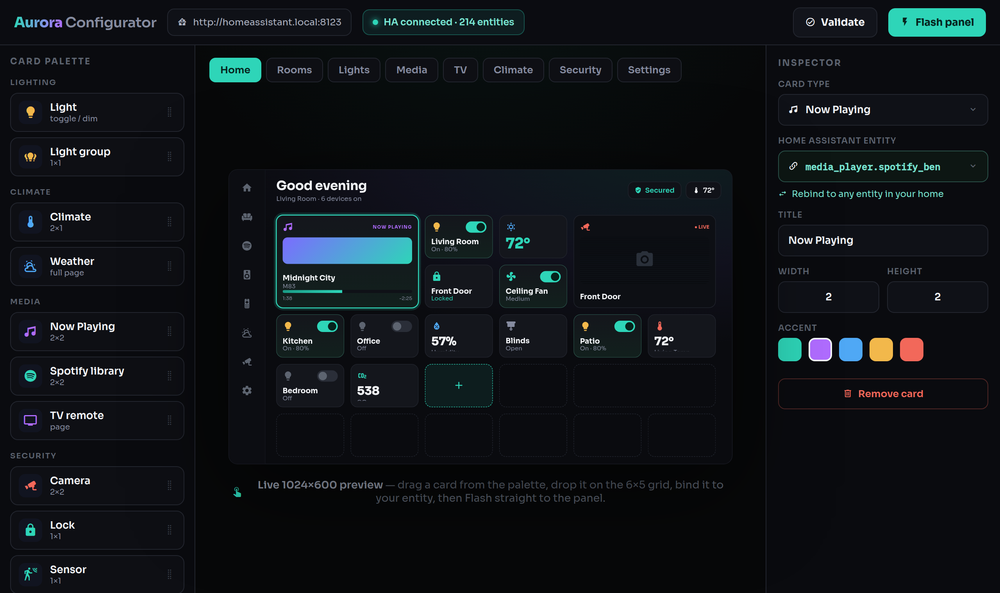

<section class="av-hero">
  

  

    
ESPHome + LVGL firmware &nbsp;·&nbsp; Guition 7″ ESP32-P4

    <h1 class="av-wordmark">Aurora</h1>
    

      A hand-crafted <strong>Home Assistant</strong> touch dashboard — dark glass, real pixels,
      and a no-code configurator that makes every screen yours.
    

    

      <a class="av-btn av-btn-solid" :href="withBase('/setup/')">Set up your panel</a>
      <a class="av-btn av-btn-ghost" :href="withBase('/cards/')">Browse the card library</a>
    

    
  

</section>

<section class="av-section av-strip-wrap">
  
Real firmware, real pixels

  

    Nothing on this site is a mockup. Every card is rendered by the same LVGL code that runs on
    the panel — <a :href="withBase('/cards/')">all 53 card types, in every size</a>.
  

  

    
  

</section>

<section class="av-section">
  
What's inside

  

    <article v-for="f in features" :key="f.t" class="av-feature">
      <h3>{{ f.t }}</h3>
      
{{ f.d }}

    </article>
  

</section>

<section class="av-section">
  
A tour of the panel

  

    <figure v-for="s in screens" :key="s.img">
      
      <figcaption>{{ s.cap }}</figcaption>
    </figure>
  

</section>

<section class="av-section av-conf">
  

    
No YAML required

    <h2>Design it your way</h2>
    

      The web configurator runs on your own machine. Point it at Home Assistant, map each card to
      your entities, arrange pages on a 6×5 grid with a live preview that matches the panel
      pixel-for-pixel — then press <strong>Flash</strong>.
    

    <a class="av-btn av-btn-solid" :href="withBase('/setup/configurator')">See how it works</a>
  

  
</section>

<section class="av-section av-end">
  <h2>Runs on a $60 panel.</h2>
  

    Guition JC1060P470C — ESP32-P4, 7″ 1024×600 IPS, capacitive touch, onboard camera. One USB-C
    cable for the first flash; wireless forever after.
  

  

    <a class="av-btn av-btn-solid" :href="withBase('/setup/')">Get started</a>
    <a class="av-btn av-btn-ghost" href="https://github.com/bdw547/aurora-dashboard">GitHub</a>
  

  

    Aurora began as a fork of
    <a href="https://github.com/jtenniswood/espcontrol">jtenniswood/espcontrol</a> and reuses its
    hardware bring-up; the dashboard is an independent rewrite. PolyForm Noncommercial license.
  

</section>

